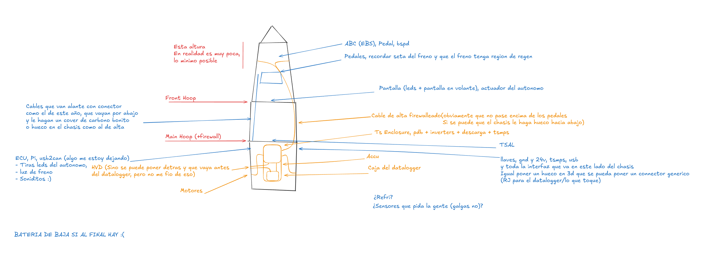

# General Layout

Algo asi, poner una explicacion de cada cosa que haga falta

La verdad en concepto de los splitters me gusta y no lo quitaria, como mucho haria un spliter custom para cada sitio en el que haga falta y asi queda todo mas clean
Pq sino si luego se lia y hay que meter una placa nueva a lo rapido se puede hacer facilmente
