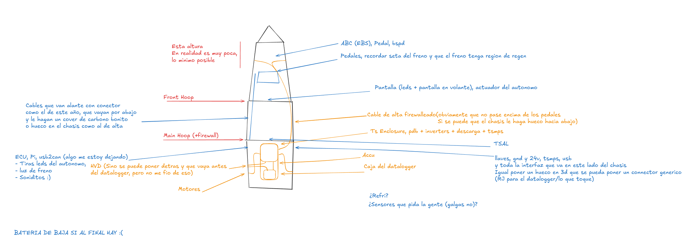

# General Layout

Algo asi, poner una explicacion de cada cosa que haga falta

La verdad en concepto de los splitters me gusta y no lo quitaria, como mucho haria un spliter custom para cada sitio en el que haga falta y asi queda todo mas clean
Pq sino si luego se lia y hay que meter una placa nueva a lo rapido se puede hacer facilmente

## Placas que llevamos
- EBS (pedida 27)
- BSPD
- CURRENT
- SENSORES FRONT
- ECU
- TER2PI (pedida 27)
- REFRI
- LVBAT (existia ya)
- AMS (pedida 27)
- SLAVES (pedida 27, si van bien hay que pedir 15 mas)
- VI (pedida 27)
- PRECH (pedida 27)
- DISCH (pedida 27)
- SPLITTERS
- PANTALLA(s)
- TSAL
- CARGADOR
- IMD
